# Strategy Builder & Worker Algorithm Build Process

This document provides a comprehensive flowchart of how the Oculus Strategy system builds trading algorithms, including the role of the LLM (Claude), iteration selection, retraining processes, and how build history influences decisions.

## Complete Build Process Flowchart

```mermaid
flowchart TD
    Start([User Initiates Build]) --> CheckRetrain{Is this a<br/>Retrain?}
    
    CheckRetrain -->|No - New Build| LoadHistory[Load Build History<br/>- Get relevant past builds<br/>- Score by asset class +10<br/>- Score by symbol overlap +3<br/>- Score by success +5<br/>- Score by recency +0-2]
    CheckRetrain -->|Yes - Retrain| LoadPriorIterations[Load Prior Build Iterations<br/>- Get all iterations from previous builds<br/>- Extract performance metrics<br/>- Extract top features used<br/>- Build iteration history context]
    
    LoadHistory --> LLMDesign
    LoadPriorIterations --> LLMDesign
    
    LLMDesign[🤖 LLM Strategy Design - STEP 0<br/>Claude Opus 4 with Extended Thinking<br/>━━━━━━━━━━━━━━━━━━━━━━━━━━━━<br/>Input Context:<br/>• Strategy name, symbols, description<br/>• Target return, timeframe<br/>• Relevant build history max 5 builds<br/>• Feature effectiveness data top 15<br/>• Prior iteration history if retrain<br/>• Asset class-specific patterns<br/>━━━━━━━━━━━━━━━━━━━━━━━━━━━<br/>LLM Outputs:<br/>• Entry/exit rules with thresholds<br/>• Forward days options<br/>• Profit threshold options<br/>• HP search iterations recommendation<br/>• CV folds, model types to train<br/>• Neural network parameters]
    
    LLMDesign --> InitConfig[Initialize Build Configuration<br/>━━━━━━━━━━━━━━━━━━━━━━━━━━━<br/>• Apply LLM design overrides<br/>• Set initial years default 0.25<br/>• Set initial HP iterations default 30<br/>• Set max iterations default 5<br/>• Initialize current_years<br/>• Initialize current_n_iter]
    
    InitConfig --> IterationLoop{Iteration Loop<br/>iteration ≤ max_iterations}
    
    IterationLoop -->|Start Iteration| CheckStop{Check Stop<br/>Signal?}
    
    CheckStop -->|Stopped| BuildStopped([Build Stopped by User])
    CheckStop -->|Continue| IncreaseParams[Set Progressive Parameters<br/>━━━━━━━━━━━━━━━━━━━━━━━━━━━<br/>Years: current_years<br/>HP Iterations: current_n_iter]
    
    IncreaseParams --> TrainModels[STEP 1: Train ML Models<br/>━━━━━━━━━━━━━━━━━━━━━━━━━━━<br/>Worker Job Processor:<br/>1. Fetch historical data<br/>   • Use Polygon API primary<br/>   • Fallback to AlphaVantage/Yahoo<br/>   • Cache for performance<br/>2. Configuration Search:<br/>   • Test forward_days options<br/>   • Test profit_threshold options<br/>   • Find best label config<br/>3. Train Multiple Models:<br/>   • RandomForest with HP tuning<br/>   • XGBoost with HP tuning<br/>   • LightGBM with HP tuning<br/>   • LSTM if enabled<br/>   • Neural Networks if enabled<br/>4. Hyperparameter Tuning:<br/>   • RandomizedSearchCV<br/>   • n_iter = current_n_iter<br/>   • cv_folds from LLM design<br/>5. Model Evaluation:<br/>   • F1 score, precision, recall<br/>   • ROC-AUC, accuracy<br/>   • Select best model]
    
    TrainModels --> ExtractRules[STEP 2: Extract Trading Rules<br/>━━━━━━━━━━━━━━━━━━━━━━━━━━━<br/>From Best Model:<br/>• Get feature importances<br/>• Analyze decision paths<br/>• Extract entry conditions<br/>• Extract exit conditions<br/>• Calculate score thresholds<br/>• Merge with LLM rules if present]

    ExtractRules --> Backtest[STEP 3: Backtest Strategy<br/>━━━━━━━━━━━━━━━━━━━━━━━━━━━<br/>Backtesting Engine:<br/>• Apply extracted rules to historical data<br/>• Simulate trades with entry/exit logic<br/>• Calculate performance metrics:<br/>  - Total return, Sharpe ratio<br/>  - Max drawdown, win rate<br/>  - Profit factor, trade count<br/>  - Risk-adjusted returns<br/>• Generate equity curve<br/>• Track trade-by-trade results]

    Backtest --> ScoreIteration[Score This Iteration<br/>━━━━━━━━━━━━━━━━━━━━━━━━━━━<br/>Composite Score Calculation:<br/>• Sharpe Ratio × 30%<br/>• Total Return × 25%<br/>• Win Rate × 20%<br/>• Profit Factor × 15%<br/>• Max Drawdown penalty × 10%<br/>• Trade Count bonus if ≥ 10<br/>━━━━━━━━━━━━━━━━━━━━━━━━━━━<br/>Store Iteration Results:<br/>• Save all metrics to database<br/>• Save model artifacts<br/>• Save trading rules<br/>• Save backtest results<br/>• Link to build_id + iteration_num]

    ScoreIteration --> UpdateBest{Is this score<br/>better than<br/>current best?}

    UpdateBest -->|Yes| SetBest[Update Best Iteration<br/>• Set best_iteration = current<br/>• Set best_score = current_score<br/>• Mark as current champion]
    UpdateBest -->|No| KeepBest[Keep Previous Best]

    SetBest --> IncreaseComplexity
    KeepBest --> IncreaseComplexity

    IncreaseComplexity[Increase Complexity for Next Iteration<br/>━━━━━━━━━━━━━━━━━━━━━━━━━━━<br/>Progressive Training Strategy:<br/>• current_years += 0.25 years<br/>• current_n_iter += 10 HP iterations<br/>• More data = better generalization<br/>• More HP search = better optimization]

    IncreaseComplexity --> IterationLoop

    IterationLoop -->|Max Iterations Reached| SelectFinal{Select Final<br/>Iteration}

    SelectFinal --> LLMReview[🤖 LLM Final Review - Optional<br/>Claude Opus 4 with Extended Thinking<br/>━━━━━━━━━━━━━━━━━━━━━━━━━━━<br/>Input Context:<br/>• All iteration results<br/>• Performance metrics for each<br/>• Trading rules for each<br/>• Backtest equity curves<br/>• Risk metrics comparison<br/>━━━━━━━━━━━━━━━━━━━━━━━━━━<br/>LLM Analysis:<br/>• Evaluate overfitting risk<br/>• Check rule consistency<br/>• Assess robustness<br/>• Recommend best iteration<br/>• Suggest improvements]

    LLMReview --> FinalSelection[Final Iteration Selection<br/>━━━━━━━━━━━━━━━━━━━━━━━━━━━<br/>Selection Logic:<br/>1. Use LLM recommendation if available<br/>2. Otherwise use highest composite score<br/>3. Apply safety checks:<br/>   • Min trade count ≥ 10<br/>   • Max drawdown ≤ 30%<br/>   • Sharpe ratio ≥ 0.5<br/>4. Mark selected iteration as ACTIVE<br/>5. Mark others as ARCHIVED]

    FinalSelection --> SaveStrategy[Save Final Strategy<br/>━━━━━━━━━━━━━━━━━━━━━━━━━━━<br/>Database Storage:<br/>• Update strategy status = ACTIVE<br/>• Save selected iteration_id<br/>• Save all performance metrics<br/>• Save model file paths<br/>• Save trading rules JSON<br/>• Save backtest results<br/>• Update build history<br/>• Timestamp completion]

    SaveStrategy --> NotifyComplete[Notify User<br/>• Send completion notification<br/>• Display final metrics<br/>• Show equity curve<br/>• Provide iteration comparison]

    NotifyComplete --> Complete([Build Complete])

    Complete -.->|Future Retrain Trigger| RetrainTrigger

    RetrainTrigger{Retrain Trigger?<br/>━━━━━━━━━━━━━━━━━━━━━━━━━━━<br/>Conditions:<br/>• Manual user request<br/>• Performance degradation<br/>• Scheduled periodic retrain<br/>• Market regime change detected}

    RetrainTrigger -->|Triggered| LoadPriorIterations

    style LLMDesign fill:#e1f5ff,stroke:#0066cc,stroke-width:3px
    style LLMReview fill:#e1f5ff,stroke:#0066cc,stroke-width:3px
    style TrainModels fill:#fff4e6,stroke:#ff9800,stroke-width:2px
    style Backtest fill:#fff4e6,stroke:#ff9800,stroke-width:2px
    style ScoreIteration fill:#f3e5f5,stroke:#9c27b0,stroke-width:2px
    style FinalSelection fill:#e8f5e9,stroke:#4caf50,stroke-width:2px
```



## Key Components Explained

### 1. LLM Role (Claude Opus 4.6 with Extended Thinking)

The LLM plays two critical roles in the build process:

**Initial Design Phase (Step 0):**
- Analyzes build history to learn from past successes/failures
- Reviews feature effectiveness data to prioritize indicators
- Considers asset class-specific patterns (crypto vs stocks vs forex)
- Designs entry/exit rules with specific thresholds
- Recommends hyperparameter search space
- Suggests model types and neural network architectures
- Uses extended thinking mode for deep analysis

**Final Review Phase (Optional):**
- Evaluates all iterations for overfitting risk
- Assesses rule consistency across iterations
- Recommends the most robust iteration
- Identifies potential improvements for future builds

### 2. Build History Usage

**History Scoring System:**
- **Asset Class Match (+10 points):** Prioritizes builds from same asset class
- **Symbol Overlap (+3 points per symbol):** Values builds with similar instruments
- **Success Score (+5 points):** Rewards builds with high Sharpe/returns
- **Recency Bonus (+0 to +2 points):** Prefers recent builds (within 30 days)

**Top 5 builds** are selected and their data is fed to the LLM for learning.

### 3. Iteration Selection Logic

**Progressive Complexity:**
- Each iteration trains with more data (years += 0.25)
- Each iteration does more HP tuning (n_iter += 10)
- Prevents overfitting by starting simple

**Composite Scoring:**
```
Score = (Sharpe × 0.30) + (Return × 0.25) + (WinRate × 0.20) +
        (ProfitFactor × 0.15) - (MaxDrawdown × 0.10) + TradeBonus
```

**Selection Priority:**
1. LLM recommendation (if available)
2. Highest composite score
3. Safety filters applied (min trades, max drawdown, min Sharpe)

### 4. Retraining Process

**When Retraining is Triggered:**
- Manual user request
- Performance degradation detected
- Scheduled periodic retrain (e.g., monthly)
- Market regime change detected

**Retraining Differences:**
- Loads ALL prior iterations from previous builds
- Extracts top-performing features from history
- LLM analyzes what worked/didn't work before
- Starts with proven configurations
- Focuses on incremental improvements

**Learning from History:**
- Feature importance trends across builds
- Optimal forward_days and profit_threshold values
- Best-performing model types for this strategy
- Successful entry/exit rule patterns

### 5. Worker Job Processing

The worker handles the heavy computational tasks:

1. **Data Fetching:** Multi-source with caching (Polygon → AlphaVantage → Yahoo)
2. **Configuration Search:** Tests multiple label configurations in parallel
3. **Model Training:** Trains 3-5 models simultaneously with HP tuning
4. **Evaluation:** Comprehensive metrics calculation
5. **Rule Extraction:** Converts ML model to interpretable trading rules

### 6. Decision Points

**Critical Decision Points in Flow:**
- **Retrain vs New Build:** Determines if we use prior iteration history
- **Stop Signal Check:** Allows user to abort long-running builds
- **Best Iteration Update:** Tracks champion iteration throughout process
- **Final Selection:** Chooses deployment-ready iteration with safety checks. LLM reviews the iterations and helps select the best iteration.

## Performance Optimization

- **Parallel Processing:** Multiple models train simultaneously
- **Data Caching:** Historical data cached to avoid repeated API calls
- **Progressive Training:** Starts fast with small datasets, scales up
- **Early Stopping:** Can abort if iterations aren't improving

## Safety Mechanisms

- **Minimum Trade Count:** Ensures statistical significance (≥10 trades)
- **Maximum Drawdown:** Prevents risky strategies (≤30%)
- **Minimum Sharpe:** Ensures risk-adjusted returns (≥0.5)
- **Overfitting Detection:** LLM reviews for suspicious patterns
- **Rule Consistency:** Validates rules make logical sense

